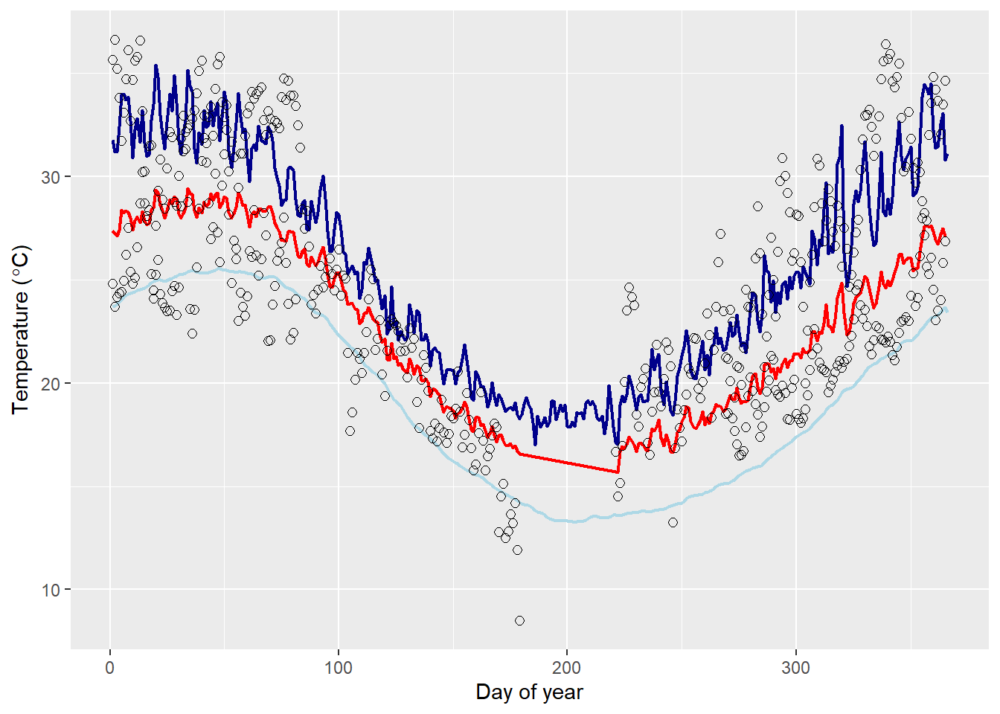

```{r setup, include=FALSE} 
knitr::opts_chunk$set(echo=TRUE)
options(scipen = 10, digits = 2)
```

## PSHB Thermal Performance Curves (TPCs)

Three of our PSHB life-history parameters are temperature-dependent: the daily probabilities of juvenile transition ($\alpha_J$), pre-oviposition transition ($\alpha_P$) and juvenile survival ($\phi_J$). To generate functions for temperature-dependent transition and survival, we fit temperature performance curves (TPCs) to empirical PSHB data. TPCs describe the relationship between temperature, $T$, and performance, $P$ (in this instance, performance is the probability of transition or survival). As described in Phillips *et al.*, (2014), a TPC function is given as a meeting of two Gaussian functions:

$$
\begin{gather}
  P(T) = 
  \begin{cases}
    \ P_{max}e^{- \frac{-(T-T_{opt})^2} {2c^2} } & \text{ for } T<T_{opt}\\
    P_{max}e^{- \frac{-(T-T_{opt})^2} {2(cd)^2} } & \text{ for } T \ge T_{opt}
  \end{cases}
\end{gather}\tag{Supp. Eq. 1}
$$ 

where $P_{max}$ is the maximum performance value and $T_{opt}$ is the optimum temperature (*i.e.*, the temperature at $P_{max}$). Performance increases with temperature up to $T_{opt}$, according to $c$. At temperatures above $T_{opt}$, performance decreases, as given by $d$.

TPCs for $\alpha_J$, $\alpha_P$ and $\phi_J$ were fit to empirical data, and values for $P_{max}$, $T_{opt}$, $c$ and $d$ were estimated  (described below). When running the population model, the daily tree temperature was input as $T$ in Supp. Equation 1, to calculate the values of $\alpha_J$, $\alpha_P$ and $\phi_J$ to use for that time-step.


### $\alpha_J$ TPC

The daily probability of juvenile PSHB transitioning to the preoviposition stage is given by $\alpha_J$. We estimated $\alpha_J$ using data from Umeda and Paine, (2019), who monitored PSHB development (from egg to the pre-oviposition stage) under temperatures ranging 18 – 32 °C. Development rates are summarised in Supplementary Table 1. We also used data from Walgama and Zalucki, (2007), who recorded development times for the tea shot hole borer (TSHB, within the *E. wallacea* species complex) at 15 – 32° C. Development times for eggs, larvae and pupae were obtained from Table 1, Figure 1, and Table 2, respectively (Supp. Table 1). For each temperature, we summed development times to calculate the total duration of the juvenile stage, $\delta$, and converted this to a daily transition rate: $\alpha_{J} = \delta^{-1}$ (Supp. Table 1). Transition rates from the two studies are plotted in Supp. Figure 1.


#### Supplementary Table 1
###### The development times of PSHB eggs, larvae and pupae at different temperatures (from Walgama & Zalucki, 2007), used to estimate daily juvenile transition rates; and daily juvenile transition rates at different temperatures given in Umeda & Paine, (2019).   

| Temperature (°C)| Egg development time (days) | Larva development time (days) | Pupa development time (days) | Juvenile transition rate (Walgama & Zalucki) | Juvenile transition rate (Umeda & Paine) |
|:--:|:--:|:--:|:--:|:--:|:--:|
| 15 | no hatching |  | no emergence | 0 |  |
| 18 | 23.5 | 34.72 | 15 | 0.014 | 0.013 |
| 20 | 18.5 | 25.06 | 14 | 0.017 | 0.02 |
| 22 | 13 |  | 9 |  |  |
| 25 | 7.3 | 14.53 | 7.5 | 0.034 | 0.0258 |
| 28 | 5.5 | 7.14 | 6 | 0.054 |  |
| 30 | 5 |  | 4 |  | 0.0421 |
| 32 | 10.9 |  | 7 |  | 0.0206 |


A TPC was fit to the empirical data using the maximum likelihood method (Supp. Figure 1).

```{r TPC.q.fit}
# Equation 1:
TPC.q<-function(Tb, rmax=10, Trmax=28, acc=9, dec.prop=0.5){
	lhs<-rmax*exp(-(Tb-Trmax)^2/(2*acc^2))
	rhs<-rmax*exp(-(Tb-Trmax)^2/(2*(acc*dec.prop)^2))
	ifelse(Tb<Trmax, lhs, rhs )
}

TPC.q.LL<-function(pars, t.data, w.data){
  E.w<-TPC.q(Tb=t.data, rmax=pars[1], Trmax=pars[2], acc=pars[3], dec.prop=pars[4])
  D.w<-w.data-E.w
  D.w<-dnorm(D.w, mean=0, sd=sd(D.w), log=TRUE) 
  -sum(D.w)
}

TPC.q.fit<-function(Tw.matrix, in.acc=10, in.dec.prop=0.5, ...){
	in.rmax=max(Tw.matrix[,2])
	in.Trmax=Tw.matrix[Tw.matrix[,2]==in.rmax,1]
	fit<-optim(fn=TPC.q.LL, par=c(rmax=in.rmax, Trmax=in.Trmax, acc=in.acc, dec.prop=in.dec.prop),
		t.data=Tw.matrix[,1], w.data=Tw.matrix[,2], method="L-BFGS-B",
		lower=c(0, 10, 1, 0.001), upper=c(1.5*in.rmax, 45, 80, 1), ...)
	fit
}
```


```{r alpha_j_data_TPC, echo=FALSE}
alpha_j_temp_umeda <- c(18, 20, 25, 30, 32)
alpha_j_rate_umeda <- c(0.013, 0.020, 0.0258, 0.0421, 0.0206)

alpha_j_temp_walgama <- c(15, 18, 20, 22, 25, 28, 30, 32)
egg_dev_time_walgama <- c(Inf, 23.5, 18.5, 13, 7.3, 5.5, 5, 10.9)
larva_dev_time_walgama <- c(NA, 1/0.0288, 1/0.0399, NA, 1/0.0688, 1/0.140, NA, NA) # extracted from figure
pupae_dev_time_walgama <- c(Inf, 15, 14, 9, 7.5, 6, 4, 7)
total_juv_dev_time_walgama <- egg_dev_time_walgama + larva_dev_time_walgama + pupae_dev_time_walgama
alpha_j_rate_walgama <- 1/total_juv_dev_time_walgama
alpha_j_rate_walgama[1] <- 0
temp <- c(alpha_j_temp_umeda, alpha_j_temp_walgama)
rate <- c(alpha_j_rate_umeda, alpha_j_rate_walgama)

source("../src/TPCFunctions.R")

TPCmatrix <- na.omit(cbind(temp, rate))
alpha_J_fit <- TPC.q.fit(TPCmatrix, in.acc = 8, hessian = TRUE)
pars <- alpha_J_fit$par

plotTemp <- seq(12, 35, 0.2)
survProbPred <- TPC.q(plotTemp, rmax = pars[1], Trmax = pars[2], acc = pars[3], dec.prop = pars[4])

plot(alpha_j_rate_walgama~alpha_j_temp_walgama,
     xlab = expression(paste("Tree temperature (",degree,"C)")), 
     ylab = expression('Juvenile transition probability ( '*alpha[J]*' )'))
points(alpha_j_rate_umeda~alpha_j_temp_umeda, pch=17)
lines(survProbPred~plotTemp)
```
  
  
  
  
#### Supplementary Figure 1
###### Juvenile transition probabilities at different temperatures, given by Umeda & Paine (triangles) and Walgama & Zalucki (circles), with TPC fitted to the data.
  
    
 
    
The parameter estimates for the TPC ($P_{max}$, $T_{opt}$, $c$, $d$) and their standard deviations (solving the Hessian matrix and taking the square root) were:

```{r alpha_J_TPC_priors, echo=FALSE}
par_names_TPC <- c(quote(P[max]), quote(T[opt]), quote(c), quote(d))
SD <- sqrt(diag(solve(alpha_J_fit$hessian)))
alpha_J_priors <- cbind(pars, SD)
rownames(alpha_J_priors) <- par_names_TPC
colnames(alpha_J_priors) <- c('Estimate', 'SD')
alpha_J_priors
```
P_max = 0.045 (0.0032)
T_opt = 29.665 (1.251)
c = 6.909 (1.0668)
d = 0.269 (0.1814)
  
    
    
### $\alpha_P$ TPC

The transition probability for the pre-ovipositing stage is given by $\alpha_P$. There is limited empirical data for this stage. In Walgama and Zalucki (2007),  the pre-oviposition period for TSHB was estimated to be 136 degree-days, or 8 days at $T_{opt}$, and with a minimum temperature of 15°C. We therefore assigned $P_{max}=1/8$. We assumed that the other TPC parameters ($T_{opt}$, $c$, $d$) were the same as for  
  
  
### $\phi_J$ TPC

The daily survival probability of juveniles, $\phi_J$, is also supposed to be temperature-dependent. Walgama and Zalucki (2007) report the total egg and pupa mortalities at different temperatures. These data (extracted from Figure 2 of that study) are provided in Supp. Table 2. We used these values of total proportion mortality, along with the total duration of eggs and pupae at each temperature (Supp. Table 1), to calculate the daily probability of survival:

$$
\phi = e^{-(\frac{-log(1-\lambda)}{\delta})}\tag{Supp. Eq. 2}
$$

where $\lambda$ is the total mortality of the stage, and $\delta$ is the total duration of the stage. Estimates of $\phi$ from the empirical data are given in Supp. Table 2, and plotted in Supp. Figure 2.

```{r phi_J_data}
# Don't need this, just showing the working of phi calculation

library(readr)
library(dplyr)
library(lubridate)
sDat <- read.csv(file = "../dat/walgamaFig2DataExtract.csv")
sDat$Mortality <- sDat$Mortality/100 # convert to probability of mortality over n days
sDat$Mortality[sDat$Mortality>1] <- 1 # catch the 1.002s
mortRate <- -log(1-sDat$Mortality)/sDat$Days # convert to a rate
mortProb <- 1-exp(-mortRate) # convert to a daily probability
```
  
  
#### Supplementary Table 2
###### Total proportion mortality of eggs and pupae at different temperatures (from Walgama & Zalucki 2007), and the daily survival probabilities estimated from these data.

| Temperature (°C)|  Total egg mortality | Total pupa mortality | Daily egg survival | Daily pupa survival |
|:--:|:--:|:--:|:--:|:--:|
| 15 |  1 | 1 |  |  | 
| 18 | 0.2 |0.278 | 0.991 |  0.979 | 
| 20 | 0.163 |0.147 | 0.990 |  0.989 | 
| 22 |  0.14 |0.124 | 0.988 |   0.985 |
| 25 | 0.12 |0.051 | 0.983 |  0.993 | 
| 28 |  0.021 |0.002 | 0.996 |  0.999 | 
| 30 | 0.051 |0.014 | 0.990 |   0.996 | 
| 32 | 0.421 |0.041  | 0.951 |  0.994 | 
  
  
As above, we fitted a TPC to the empirical data (Supp. Fig. 2) and estimated the parameter values for the TPC function.

```{r plot_phi_J_TPC, echo=FALSE}
survProb <- 1-mortProb
sDat <- cbind(sDat, mortProb, survProb)

TPCmatrix <- cbind(sDat$Temperature, survProb)
TPCmatrix <- na.omit(TPCmatrix)
pars <- TPC.q.fit(TPCmatrix, in.acc = 0.3)$par
temps <- seq(10, 35, 0.1)
survProbPred <- TPC.q(temps, rmax = pars[1], Trmax = pars[2], acc = pars[3], dec.prop = pars[4])
plot(survProb~sDat$Temperature,
     xlab = expression(paste("Temperature (",degree,"C)")), 
     ylab = expression('Juvenile survival probability ( '*phi[J]*' )'))
lines(survProbPred~temps)
```
  
#### Supplementary Figure 2
###### Juvenile survival probabilities at different temperatures given by Walgama & Zalucki, with TPC fitted to the data.

 

```{r phi_j_TPC_priors_2, echo=FALSE}
phi_J_fit <- TPC.q.fit(TPCmatrix, in.acc = 0.3, hessian = TRUE)
phi_J_pars <- phi_J_fit$par
phi_J_pars_sd <- sqrt(diag(solve(phi_J_fit$hessian)))
phi_J_priors <- cbind(phi_J_pars, phi_J_pars_sd)
rownames(phi_J_priors) <- par_names_TPC
colnames(phi_J_priors) <- c("Estimate", "SD")
phi_J_priors
```
P_max = 0.99 (0.004)
T_opt = 29.5 (2.358)
c = 80 (36.043)
d = 0.15 (0.188)

## Tree temperature predictions

Tree temperature, $T_{tree}$, was a weighted function of the maximum air temperature, $T_{max}$, and the soil temperature, $T_{soil}$:

$$
T_{tree} = p_tT_{max} + (1-p_t)T_{soil}\tag{Supp. Eq. 3}
$$

This assumes that the internal wood temperature does not exceed the maximum air temperature, nor get lower than the temperature of the soil. The relative weight of $T_{max}$ and $T_{soil}$ is given by $p_t$, which can take a value between 0 and 1. $p_t$ is a function of the relative humidity, $H$. Specifically, we assumed a linear relationship with humidity:

$$
\text{logit}(p_t) = bH+c\tag{Supp. Eq. 4}
$$

To estimate values for $b$ and $c,$ we fitted this model in a Bayesian framework using Hamiltonian Monte Carlo (HMC) Markov Chain, implemented in the greta package (Golding, 2019). The prior probabilities for $b$ and $c$ were both set as normal distributions with a mean of 0 and standard deviation of 3.


``` {r get_temp_data, echo=FALSE}
library(greta)
```


 

#### Supp. Figure
###### Mean daily tree temperatures per day of year, as recorded by sap flow loggers (points), and as predicted by our model (red line), given the mean daily maximum air temperature (dark blue line) and soil temperature (light blue).

The estimates for $b$ and $c$ from the HMC function were:
``` {r pt_coeffs}
#pt_coef <- summary(draws)$statistics
#rownames(pt_coef) <- c("c", "b", "SD")
#pt_coef
```
c = -0.23 (1.13)
b = -0.54 (1.03)
SD = 4.28 (0.91)

When running the population model, tree temperatures were calculated each time-step according to Supp. Equations 3 and 4, using the coefficient values given above and that day's $T_{tree}$, $T_{soil}$ and $H$ values.


## Estimating diffusion coefficient

To estimate the diffusion coefficient, $D$, we generated a dispersal kernel for PSHB using mark-release-recapture data provided by Owens et al., (2019). We fit to these data a 2D Gaussian density function, to predict the number of individuals dispersing to a single point at distance $d$ from the release point.

We assumed that each trap had a detection radius, $r$, so that any beetle dispersing to within $r$ of the point will be counted. Hence, the 2D density function was multiplied by $\pi r^2$ to capture all individuals within the detection radius.

The complete function was:
$$
n(d) = \frac{\frac{n_0} {\sqrt{2\pi\sigma^2}}e^{-\frac{d^2}{2\sigma^2}}}{2\pi d}\pi r^2\tag{Supp. Eq. 5}
$$

We then used Bayesian inference with the greta package to fit this model to the mark-recapture data, and to estimate values for $\sigma$ and $r$. We chose uninformative priors of $\sigma \sim \text{unif}(0, 300)$ and $r \sim \text{unif}(0, 100)$. The total number of dispersing individuls was $n_0=7007$ (from the mark-recapture data).

```{r dispersal inference, echo=FALSE}
#### Repeat above using Owens dispersal data ####
library(readr)
library(dplyr)
recap <- read_csv("../src/owens_recap.csv")
ps <- aggregate(ntrap ~ trapID + dist, data = recap, FUN = sum) # sum trap counts across all trials
ps <- ps[-(ps$trapID=="RP"),] # remove counts of non-dispersers (remaining at Release Point)
colnames(ps)[2:3] <- c('d', 'obs')
nr <- sum(subset(recap, trapID=='RP')$nfly) # total n PSHB that dispersed

dfun <- function(d, dens0, sigma, radius){
  # density at distance d according to 2D Gaussian function
  d.at.d <- dens0 / sqrt(2*pi*sigma^2) * exp(-(d^2/(2*sigma^2))) / (2*pi*d)
  # expected count
  d.at.d * pi * radius^2
}

library(greta)

# name data variables
d.obs <- as_data(ps$obs)
d.d <- as_data(ps$d)

# define priors
d.sigma <- uniform(0, 300) # possible dispersal sigmas
t.rad <- uniform(0, 100) # possible radii

# define model
expected.count <- dfun(d.d, nr, sigma = d.sigma, radius = t.rad)
distribution(d.obs) <- poisson(expected.count)

g.mod <- model(d.sigma, t.rad)
plot(g.mod)

# sample the posterior
draws <- mcmc(g.mod, n_samples = 1000, chains = 4)

# did it converge?
coda::gelman.diag(draws)
bayesplot::mcmc_trace(draws)
```

```{r d.sigma}
# How close did we come to input parameter values?
summary(draws)

```
The mean estimate from Bayesian inference was $\sigma=35.6$, which we used to calculate the diffusion coefficient, as $D=\frac{\sigma^2}{2t}$.
